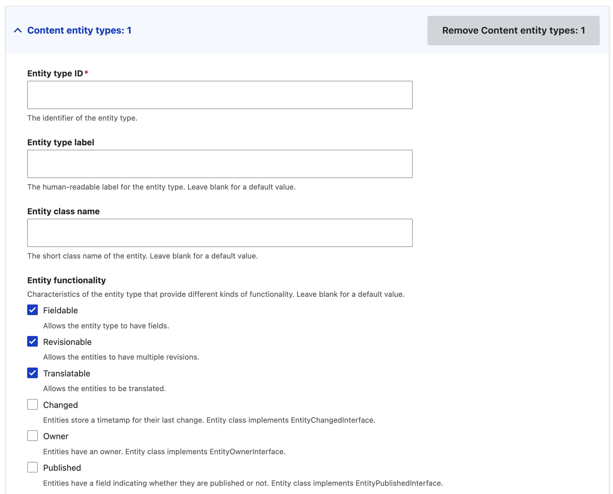
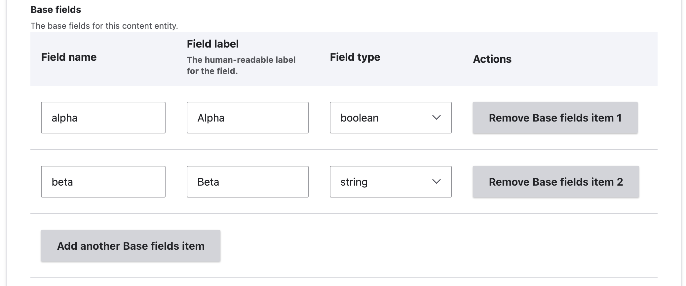
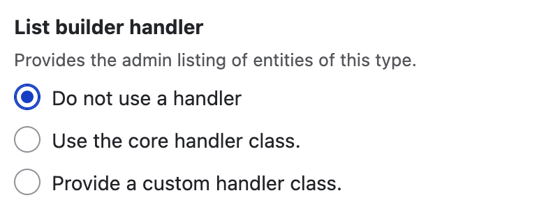

+++
menus = 'entities'
title = 'Entity types form'
weight = 14
+++

# Entity types form

The entity types page lets you create new [content entity types and config entity
types](https://www.drupal.org/docs/drupal-apis/entity-api/entity-types).

## Content entity types

Content entity types are stored in the site's database, and are typically
created by site editors. They can have admin-created fields and revisions.
Nodes, taxonomy terms, media, path aliases, and users are all content entity
types.

1. In the Content entity types form section, click 'Add Content entity type'.
   This adds a form section for the entity type.

  

2. Enter the machine ID of the entity type. This will automatically fill in  the
   entity type label and class name, but you can change these to something
   different.
3. Select as many of the Entity functionality options you want for your entity
   type:

   Fieldable
   : The entity type can have fields.

   Revisionable
   : The entities can have multiple revisions.

   Translatable
   : The entities can be translated.

   Changed
   : The entities have a timestamp field that stores their last change. The
   entity class will implement EntityChangedInterface.

   Owner
   : The entities have a field that stores a user reference to their
     author. The entity class will implement EntityOwnerInterface.

   Published
   : The entities have a status field indicating whether they are
     published or not. The entity class will implement EntityPublishedInterface.

4. The 'Provide UI' options are a shortcut to set a large number of the entity
   handler options that follow. You can still set options for entity handlers,
   and the presets for the 'Provide UI' options will merge with your settings.

   None
   : No presets are applied to the entity handler options. Use this option if
     your entity type does not need a UI, or you know what combination of entity
     handlers you need.

   Default UI
   : Creates a UI for your entity type which uses the site theme. This will make
     them work similarly to nodes.

   Admin UI
   : Creates a UI for your entity type which uses the admin theme. This will
     make them work similarly to most config entity types.

5. You can define a config bundle entity type for your entity type. This is
   analogous to the 'Node type' config entity type being the bundle entity type
   for the 'Node' content entity type, or the 'Taxonomy vocabulary' and
   'Taxonomy term' entity types. Clicking the 'Add Bundle config entity type'
   will add a form section for this entity type. It will be similar to the form
   section for config entity types: see below.
6. You can add base fields for your entity type. Note that the 'Entity
   functionality options' above will automatically add the relevant base
   fields such as 'owner', 'changed', and so on.

   

   To add base fields:

   1. Click 'Add base fields item'. This adds a table row to the base fields
      table form element.
   2. Enter the field machine name.
   3. The field label will fill automatically.
   4. Select the field type.
   5. You can add as many base fields as you like.

7. Specify which [entity
   handlers](https://www.drupal.org/docs/drupal-apis/entity-api/handlers) your
   entity type uses. Entity handlers are classes which control a particular area
   of functionality for an entity type.
   - For most handler types, the options are:
     - Don't specify a handler class for this handler type at all. The entity
       type will not provide the functionality for this handler type.
     - Use the generic class from Drupal core for this handler type.
     - Create a custom handler class for this entity type. This allows your
       entity type to have custom functionality.

       

   - There are some handler types that all entity types have: Drupal Entity API
     will use a generic handler class if none is specified. In this case, the
     only option is whether to add a custom handler class or not.

## Config entity types

Config entity types are stored in the configuration system, and are typically
created by developers and site administrators. Node types, taxonomy
vocabularies, views, image styles, and content formats are all content entity
types.

The config entity type form section is broadly similar to the content entity
type section, except for the following:

- The 'Entity functionality' only has one option:

  Plugin collection
  : The entities of this type use plugins to provide swappable behaviour. This
  is how block entities work in core, and also flag entities in [Flag
  module](http://drupal.org/project/flag). The entity class will implement
  EntityWithPluginCollectionInterface.

- Base fields fields are not available.
- Some of the handler options are different, for example, there is no storage
  handler option as config entities are stored in the configuration system.

