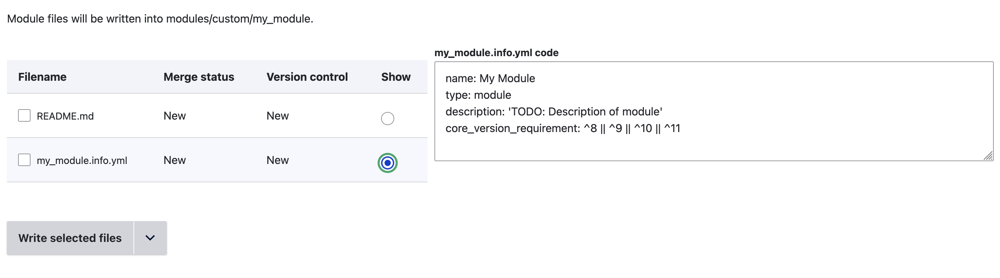

+++
menus = 'generate'
title = 'Generate page'
weight = 100
+++

# Generate page

The Generate tab generates the code based on the data entered for the module,
and lets you write the code files.

You can generate code at any time, and you can edit the module's options and
return to the Generate tab to generate code again.

Some types of component will merge with existing code; for others, you will need
to use version control if there is an existing file for the component.

The generated files for the module are shown in a table with their merge status
and version control state. These two pieces of information tell you whether it
is safe to write a particular file.

Filename
: This is the filename and relative path within the module. For example, a Block
plugin file would show as `src/Plugin/Block/MyBlock`.

Merge status
: This shows whether the file has been merged with an existing one.
  - New: There is no existing file. Writing this file will not overwrite
    anything.
  - Merged: The generated file incorporates an existing file. Writing this file
    *should* not overwrite anything, but ensure the existing file is committed
    to version control as a precaution.
  - Overwritten: There is an existing file which is *not* merged with the
    generated code. Writing this file will overwrite the existing file! Commit
    the existing file to version control if you do not want to lose it!

Version control
: This shows the file's status in git, if the module's folder is a git
repository:
  - New: The file is not under version control.
  - OK: The file is under version control and has no changes. It is safe to
    overwrite it.
  - UNMANAGED: There is an existing file which is *not* under version control.
    Overwriting this will lose the existing file's contents.
  - UNCOMMITTED CHANGES: The file is under version control, but has local
    changes. Overwriting this will lose the uncommitted changes.

It is **strongly** recommended that you use version control when adding files to
an existing module.

The radio buttons on the right of the table let you preview any of the files in
the textarea on the right. Note that changes made in this textarea will have no
effect on the written files.

Use the dropdown button at the bottom of the form to write some or all of the files:

- Write selected files: This writes all the files whose checkbox in the table is enabled.
- Write new files: This writes all the files which do not already exist on disk. This ignores the checkboxes.
- Write all files: This writes all the files in the table.
