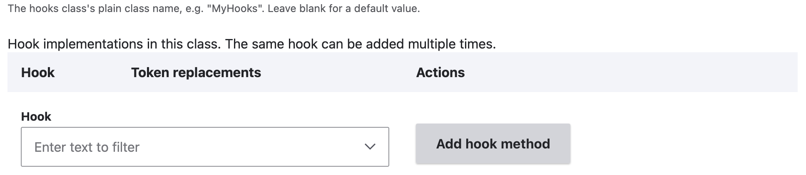
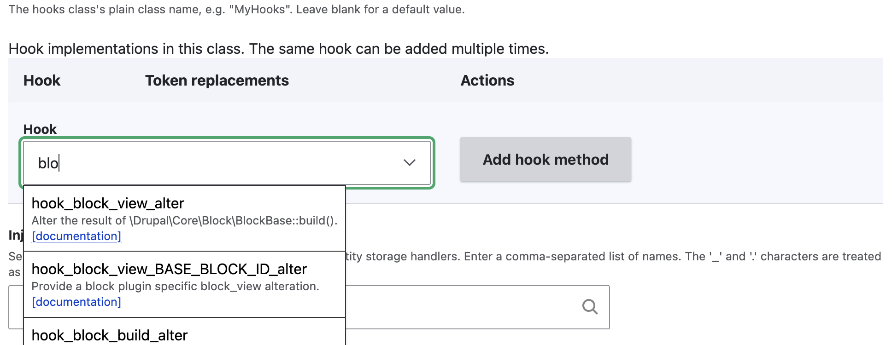
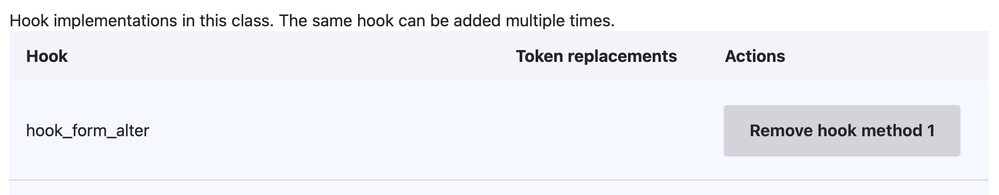
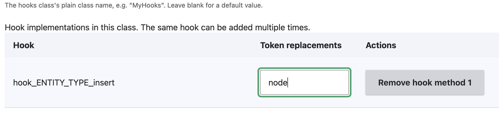

+++
menus = 'main'
title = 'Hooks form'
weight = 11
+++

## Hooks form

The Hooks tab lets you add hook implementations. These can be procedural
functions, or use the new object-oriented-style hooks which are methods in a
class.

### Object-oriented hooks

Object-oriented hooks are methods in a PHP class. These were [introduced in
Drupal 11.1](https://www.drupal.org/blog/drupal-11-1-0), and can be
backwards-compatible with older versions of Drupal.

1. Click the 'Add a Hook classes item' button. This adds a new section to the
   form for the hooks class. This shows:
   - The hooks class name.
   - A table of hooks implementations.
   - The injected services.

2. The bottom (and currently only) row of the hook implementations table shows
   a search box for the hook name. Start typing part of the hook name to filter
   the autocomplete dropdown. You can click on the documentation link for a hook
   to read more about it on the Drupal API site.

3. Click on the hook in the dropdown, then click the
   'Add hook method' button. This adds your hook to the table.

4. If your hook uses token replacements in its name (such as
   `hook_form_FORM_ID_alter`, or `hook_ENTITY_TYPE_access`), its table row will
   show a text box for the value. So for example, if you want to implement
   `hook_node_access`, enter 'node'.

5. You can add as many hooks methods as you want.
6. You can add services to inject into the hooks class. The 'Injected
   services' form element has an autocomplete.
7. You can add as many hook classes as you like.

### Procedural hooks

Procedural hooks are functions in plain PHP file, often the `.module` file.

Some hooks cannot be object-oriented, and must be implemented as procedural. For these, use
the hook groups section of the form.

1. In the 'Hook implementation type' radios element, select 'Functions in
   procedural files'.
2. Start typing the hook name in the filter below.
3. Select the hook's checkbox.

