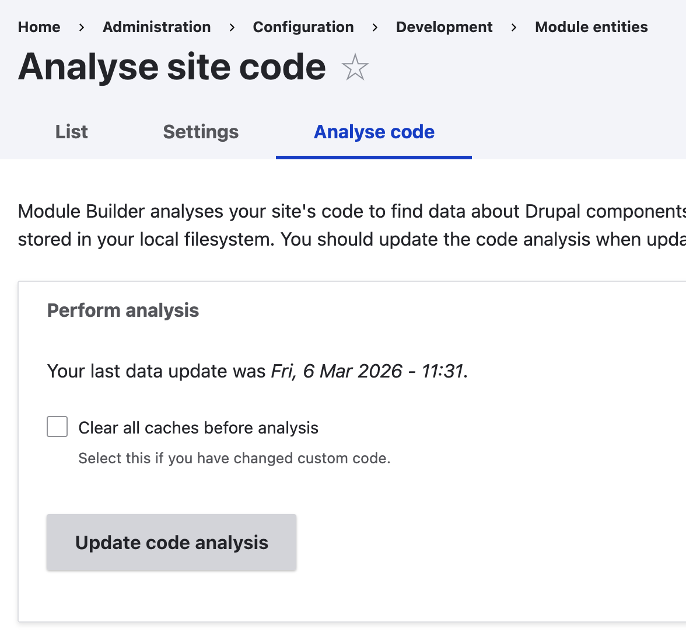

+++
menus = 'installation'
title = 'Installation'
weight = 1
+++

# Installation

Module Builder is a Drupal module, and [is installed like any other module](https://www.drupal.org/docs/extending-drupal/installing-modules):

1. Install Module Builder using Composer:

```
composer require drupal/module_builder
```

2. Enable the module in the UI on the Extend page, or with Drush.

3. Go to Administration › Configuration › Development › Module Builder › Analyse
   code.



4. Click the 'Update code analysis' button.

You should run the code analysis again if you have enabled new modules, updated
modules, or added code to your custom modules, so that Module Builder knows
about new components in your codebase.

After the analysis has run, the page will show a list of all the components it
has detected. On a typical site, you might have over 300 hooks and over 50
plugins types, for example.
