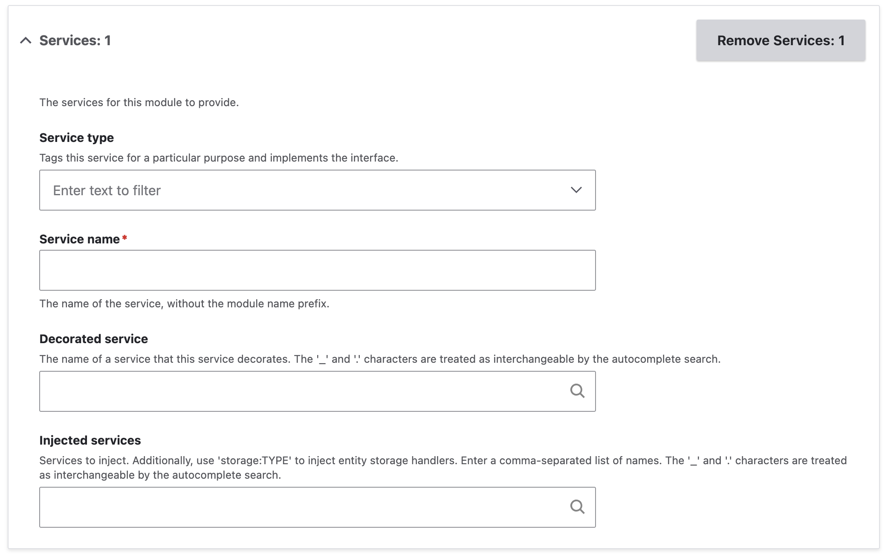
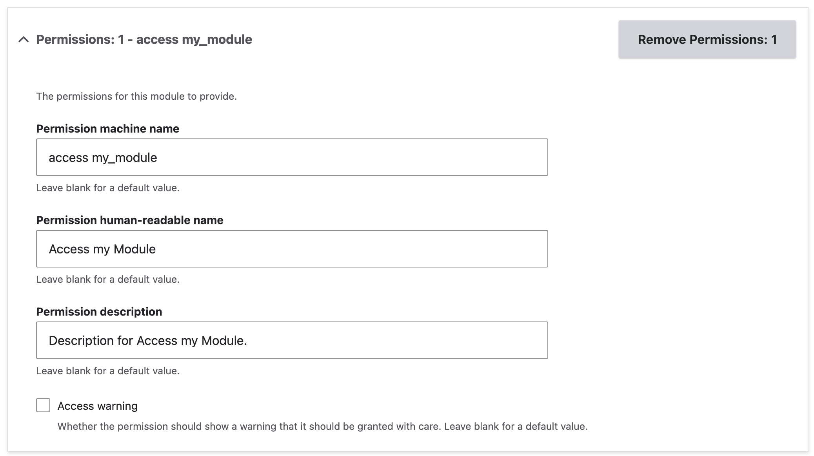
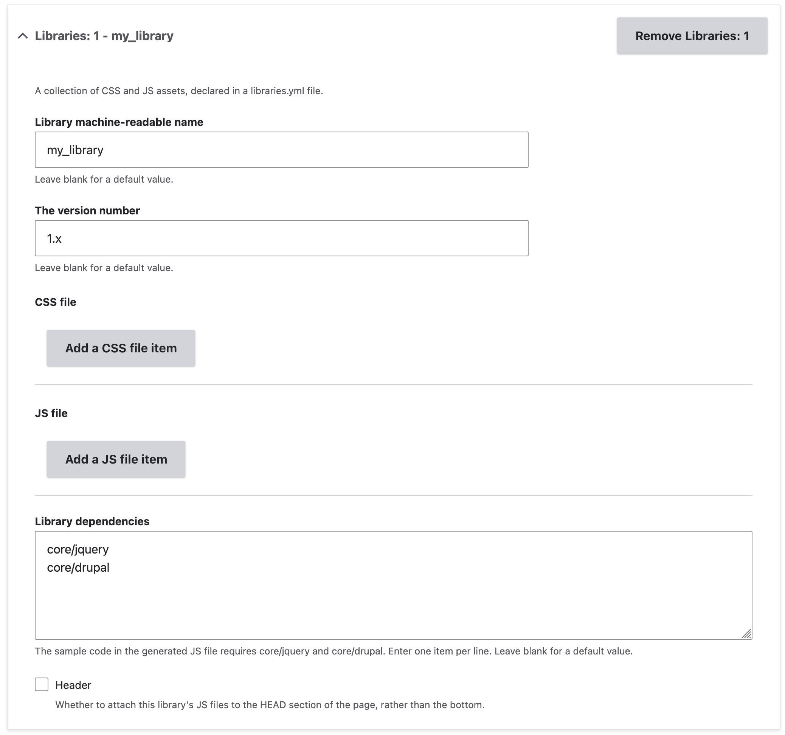

+++
menus = 'misc'
title = 'Miscellaneous form'
weight = 16
+++

# Miscellaneous form

The Miscellaneous tab lets you various components, including:

- Services
- Event subscribers
- Events
- Permissions
- Theme hooks
- Libraries
- Drush commands

## Services

Services are classes which provide some sort of API, and [which are obtained from
the service container](https://www.drupal.org/docs/drupal-apis/services-and-dependency-injection/services-and-dependency-injection-in-drupal).

1. Click 'Add a services item'. This adds a form section for the service.

  

2. Optionally, select a service type. This adds a [service
   tag](https://www.drupal.org/docs/drupal-apis/services-and-dependency-injection/service-tags)
   to your service, and makes your service implement a particular API, and the
   service will typically be collected by another service and its methods called
   by the collector.
3. Enter the service's name. The module prefix will be added automatically when
   the module code is generated.
4. You can optionally have your service class decorate an existing service. This
   allows you to override the existing service's behaviour.
5. You can add services to inject into the service class. The 'Injected
   services' form element has an autocomplete.

## Event subscribers

An event subscriber is a particular type of service that reacts to events. The
[Drupal event
system](https://www.drupal.org/docs/develop/creating-modules/subscribe-to-and-dispatch-events)
is based on the Symfony event system.

The form section is the same as for services (see above), with the addition of
a form element to select the names of events to listen to.

The generated event subscriber class will have a method for each selected event.

## Events

The events form section lets you define events that you can trigger in module
code, and listen to with subscribers.

1. Click 'Add an events item'. This adds a new row to the table.
2. Enter a name for the event. This should be a string in snake case. The
   generated code will automatically add the name of the module as a prefix.
3. Add a description for the event.

## Service provider

Enable the 'Service provider' checkbox to add a service provider class, which
allows services to be defined dynamically.

## Permissions

[Permissions](https://www.drupal.org/docs/roles-and-permissions) allows your
module to control which users have access to particular functions or pages.

1. Click 'Add a permissions item'. This adds a form section for the permission.

  

2. Enter the machine name for the permission. This is the string that code that
   checks for access will use.
3. Enter the human-readable name for the permission. This is what is shown to
   admin users in the permissions UI.
4. Enter the description for the permission. This is also shown to admin users
   in the permissions UI.
5. If your permission should show a warning in the permissions UI because of
   what it grants access to, select the 'Access warning' checkbox.

## Theme hooks

[Theme hooks](https://www.drupal.org/docs/develop/theming-drupal/twig-in-drupal/create-custom-twig-templates-for-a-custom-module) allow you to add Twig templates to output your module's content.

To add theme hooks, enter the name of the hook in the Theme hooks text area, one
hook name per line.

Each theme hook will add:
- A definition in the return value of a hook_theme() implementation in your
  module.
- A basic Twig template for your theme hook.

## Libraries

[Libraries](https://www.drupal.org/docs/develop/creating-modules/adding-assets-css-js-to-a-drupal-module-via-librariesyml) are a way of attaching JavaScript and CSS files to a page. Each
library can have one or more of both types of file.

1. Click 'Add a Libraries item'. This adds a form section for the library.

  

2. Enter the machine name for the library.
3. The version number of a library should be incremented whenever its asset
   files change, so it can be left as the default of '1.x'.
4.
