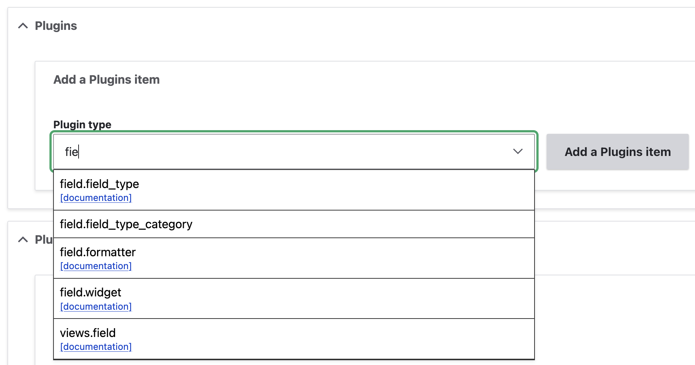
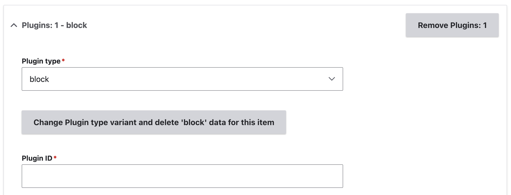
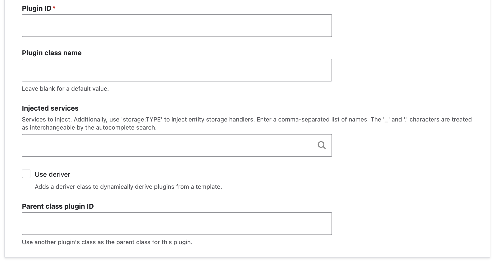
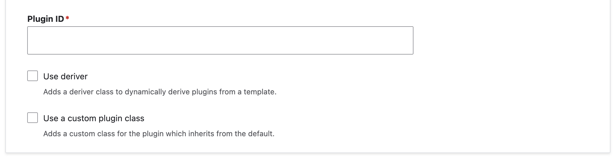
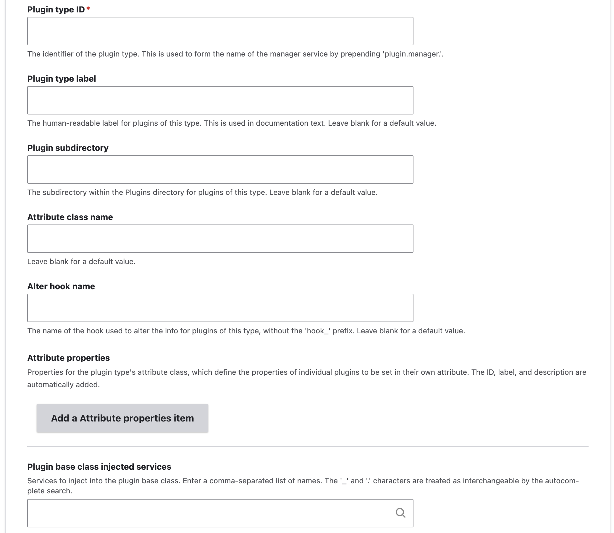

+++
menus = 'main'
title = 'Plugins form'
weight = 12
+++

## Plugins form

The Plugins tab lets you add plugins and plugin types.

### Plugins

The plugins section of the form lets you add plugins.

1. In the Plugin type form element, start typing part of the plugin type name to
   filter the autocomplete dropdown. You can click on the documentation link for
   a plugin type to read more about it on the Drupal API site.

  

2. Select one of the plugin types.
3. Click 'Add a plugins item'. This adds a form section for the plugin.

  

4. Enter the plugin ID.
5. The rest of the form differs depending on the type of the plugin.

#### Attribute or annotation-based plugins

These are plugins which are a class with an attribute or annotation to declare
it to the plugin system. Module Builder detects whether the plugin type uses
attributes or annotations.

All the form elements after the plugin ID are optional.

  

1. The class name form element will fill in automatically based on the plugin ID you enter.
   You can change this if you want.
2. You can add services to inject into the plugin class. The 'Injected
   services' form element has an autocomplete.
3. You can set the plugin to use a deriver. This adds a deriver class which
   [dynamically defines multiple
   plugins](https://www.drupal.org/docs/drupal-apis/plugin-api/plugin-derivatives)
   based on the plugin class. You can specify services to inject into the
   deriver class.
4. You can specify another plugin whose class will be used as the parent of your
   class.

You can have your plugin class replace the class of an existing plugin, instead
of being a new plugin. This will add an implementation of the plugin info alter
hook to switch the original plugin class with your class. To do this:

1. Specify the plugin to replace as the 'Parent class plugin ID'
2. Enable the 'Replace parent plugin' checkbox.

#### YAML plugins

These are plugins which are defined in a YAML file.

All the form elements after the plugin ID are optional.

  

3. You can set the plugin to use a deriver. This adds a deriver class which
   [dynamically defines multiple
   plugins](https://www.drupal.org/docs/drupal-apis/plugin-api/plugin-derivatives)
   based on the plugin class. You can specify services to inject into the
   deriver class.
2. You can specify to add a custom class for your plugin. YAML plugins typically
   all use a single class, unless a different one is specified in the plugin
   definition.
3. If using a custom plugin class, you can add services to inject into it. The
   'Injected services' form element has an autocomplete.

### Plugin types

The plugin types section of the form lets you add plugin types.

This will generate several code files, including:

- A base class for the plugin type's plugins.
- An interface for the plugin type's plugins.
- A plugin manager service class.
- An api.php file documenting the plugin type alter hook.

1. Select the plugin discovery type. This can be one of:

   Attribute-based plugins
   : Each plugin is a class with an attribute to declare the plugin data. Examples
     of this are block plugins, field types, widgets, and formatters, and Views
     handlers.

   Annotation-based plugins
   : Each plugin is a class with an annotation to declare the plugin data. This
     type is now replaced by attributes in Drupal core, and will be deprecated.

   YAML-based plugins:
   : Plugins are declared in a single YAML file, and usually share a single
     class. Examples of this are breakpoints, and menu links, tasks, and
     actions.

2. Click 'Add a plugin types item'. This adds a form section for the plugin type.

  

3. Enter the plugin type ID. This will be used to form the service ID of the plugin manager service.
4. Subsequent form elements for the label, class name, subdirectory, and so on
   are filled in automatically for you. You can rewrite these if you want.
5. For an attribute or annotation plugin, you can add properties in addition to
5. the ID, label, and description
   which are automatically included.
6. You can add services to inject into the plugin base class. The 'Injected
   services' form element has an autocomplete.

Once you have generated the code files for your plugin type, you can enable the module, re-do code analysis,
and then Module Builder will be able to generate plugins of this new type.
