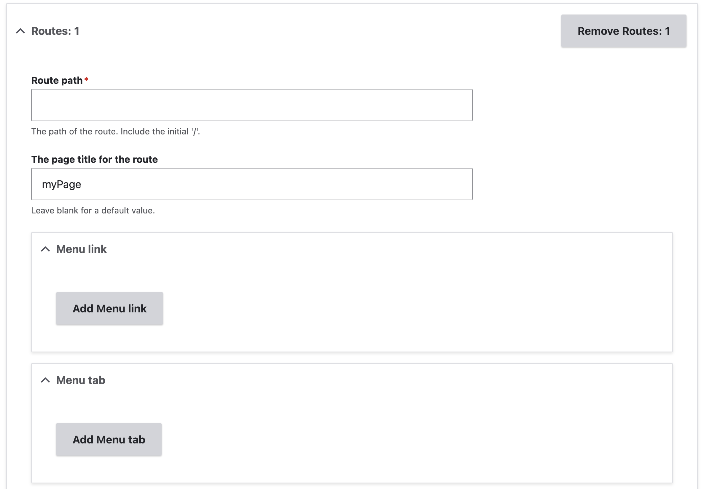
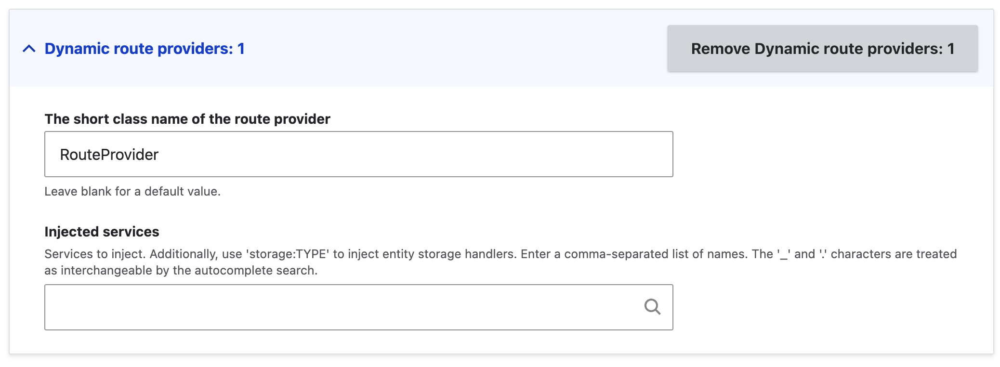
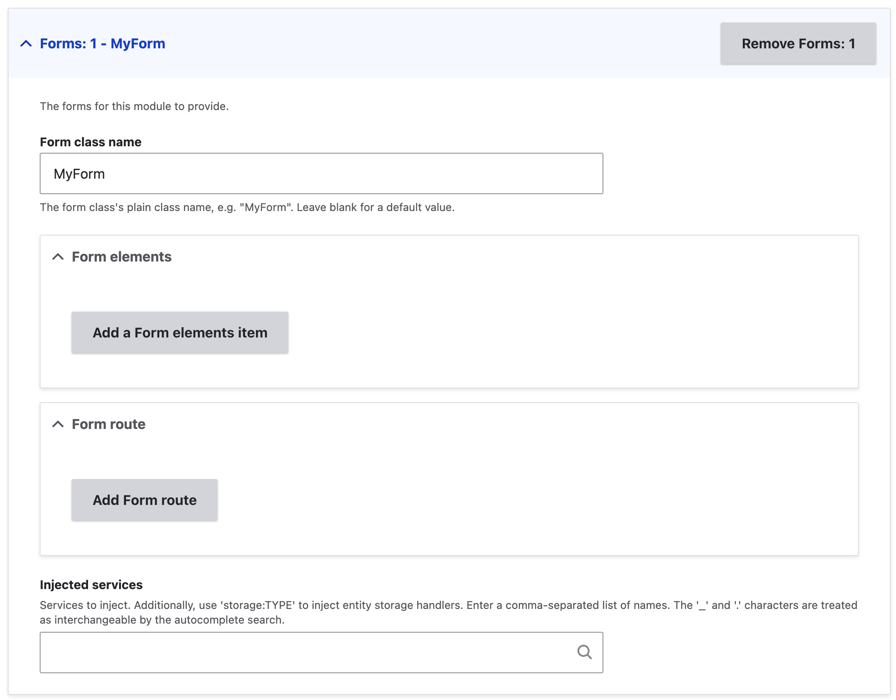
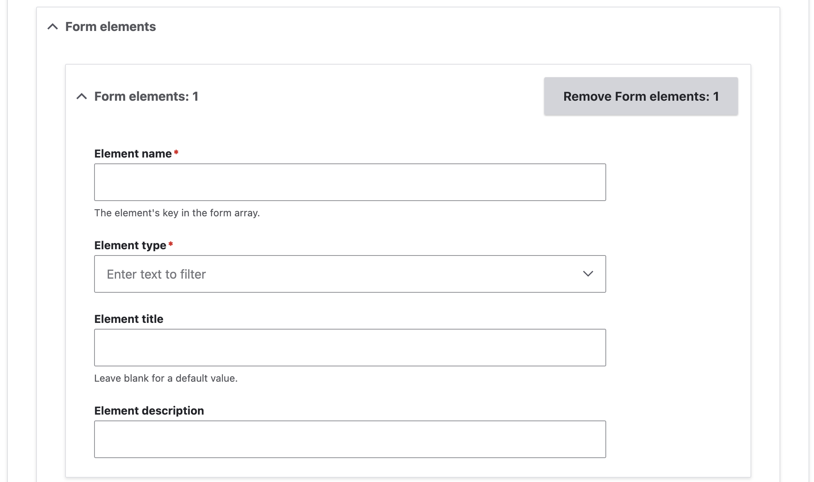

+++
menus = 'routes_forms'
title = 'Routes & forms form'
weight = 14
+++

# Routes & forms form

The Routes & forms tab lets you add components to do with forms and pages on
your site.

## Routes

The routes form section lets you add route items. (For dynamic routes, see
below).

1. Click the 'Add a Routes item' button. This adds a new section to the form.

  

2. Enter the route path. This must begin with a '/'.
3. Enter the title for your route.
4. To add a menu link for your route, click 'Add menu link'. This adds a form
   section in which you can set the menu link title.
5. To add a menu tab for your route, click 'Add menu tab'. This adds a form
   section in which you can set the menu tab title, and the parent tab route.
6. In the 'Controller type' form section, you can select what type of controller
   your route uses.

   1. Select the controller type option:
   2. Click 'Set Controller type variant'. This adds a new form section based on
      your controller type selection.

      Controller class
      : The route uses a method in a PHP class to provide its content. This will
      add a controller class automatically. You can select services to inject into
      it.

      Form
      : The route shows a form. You can either:
      - Enter the name of an existing form class
      - Use one of the forms defined further down on this page: use the syntax '!N'
        to use the Nth form, for example, '!1'.

      Alternatively, you can define the form in the 'Forms' section below, and
      add the route for the form within that section.

      Entity view display
      : The route shows an entity. You can select the type of the entity to show,
      and enter the view mode to use.

      Entity form display
      : The route shows an entity form. You can select the type of the entity to
      show, and enter the form mode to use.

      Entity list
      : The route shows a list of entities. You can select the type of the entity
      to show.

7. In the 'Access type' form section, you can select what type of access control
   your route uses:

   No access control
   : Your route has no restrictions on it at all: any user, anonymous or authorised, can access it!

   Permission
   : Access to your route is controlled by a permission. You can enter the name
   of the permission to use.

   Role
   : Access to your route is controlled by a role. You can enter the name
   of the role to use.

   Custom access
   : Access to your route is controlled by a custom callback which returns an
   AccessResult. You can select one of the following options.
   - A method in the route controller.
   - A method in a custom class
   - An existing static method on a class.

## Dynamic route providers

Dynamic route providers are PHP classes which define any number of routes. This
allows routes to depend on other parts of Drupal, such as config entities. For
example, this is how Views defines a route for each page display in a view.

1. Click 'Add a Dynamic route providers item'. This adds a form section.

  

2. Enter the short class name. All route provider classes go in the same
   namespace in your module.
3. You can specify services to inject into the route provider class.

## Admin settings form

You can add a form to provide settings for your module. This works similarly to
general forms: see the next section.

## Forms

The forms section lets you add form classes to your module.

1. Click 'Add a Forms item'. This adds a form section.

  

2. Enter the short name of the form class. All form classes go in the same
   namespace in your module.
3. You can add form elements.
   1. Click 'Add a Form elements item'. This adds a form section.

   

   2. Enter a name for the element. This is the string that is used as an array
      key in the [FormAPI
      array](https://www.drupal.org/docs/drupal-apis/form-api/form-render-elements).
   3. Select the element type.
   4. Enter a title and description for the form element.
4. You can add a route that shows your form.
   1. Click 'Add a Form route'. This adds a form section for the route: see the
   'Routes' section above for more on this.
3. You can specify services to inject into the form class.
