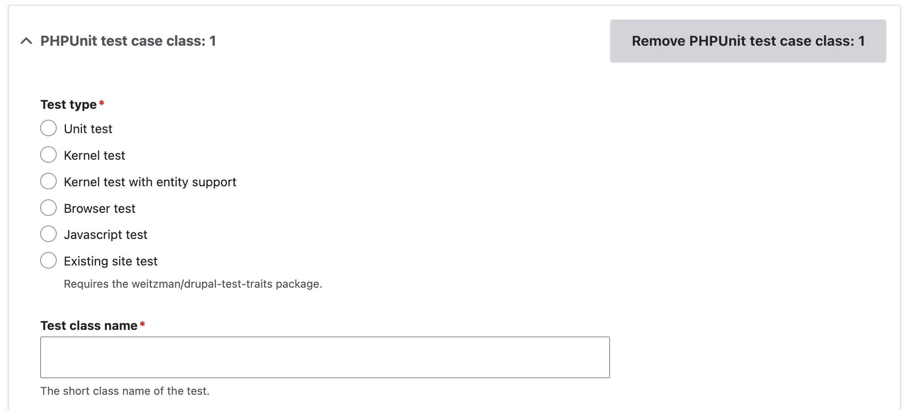

+++
menus = 'tests'
title = 'Tests form'
weight = 15
+++

# Tests form

The Tests tab lets you add PHPUnit tests.

1. Click 'Add a PHPUnit test case class item'. This adds a form section for the
   test class.

  

2. Select the [test
   type](https://www.drupal.org/docs/develop/automated-testing/types-of-tests).
   This determines the base class the test will use.

   Unit test
   : These are pure PHPUnit tests which don't install Drupal. They run very fast
     but do not have access to the database or Drupal's APIS.

   Kernel test
   : These install a basic Drupal site and can enable modules, but they do not
   run the installation for any modules. [Tasks such as setting up entity types,
   creating database tables, and installing default
   config](https://www.drupal.org/docs/automated-testing/phpunit-in-drupal/setup-tasks-in-kernel-tests)
   will need to be done in the test. They have access to all of Drupal's APIs,
   and run fairly fast. It is possible to [make HTTP requests to the test site
   and make simple assertions about the
   response](https://www.drupal.org/docs/develop/automated-testing/phpunit-in-drupal/making-http-requests-programmatically-in-kernel-tests).

   Kernel test with entity support
   : This is a kernel test as above, using EntityKernelTestBase as the test
   class parent.

   Browser test
   : This installs a full Drupal site, and allows HTTP requests to be made to
   the test site using [Mink](https://mink.behat.org/en/latest/). These are
   considerably slower than Kernel tests.

   JavaScript test
   : These are like Browser tests, but additionally use Nightwatch to test
   JavaScript functionality.

   Existing site test
   : These make assertions against the existing site instead of installing a
   test site. This requires the [DTT](https://git.drupalcode.org/project/dtt/) package.

3. Enter the short class name of the test.
4. Optionally, enter services that your test uses.
5. Optionally, enter services that your test needs to mock.
6. Optionally, select traits to use in your test's class. These provide various
   helper methods for setting up your test site.
7. You can add a fixture module for your test to install. **WARNING**: this adds a
   form section which consists of ALL the module options, and can be quite hard
   to navigate. If your fixture module needs many components, consider creating
   it as a complete Module Builder module, and using the location option to
   write it into your main module.
